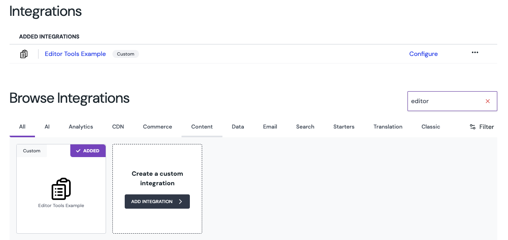

# Editor Tools location example

One of the UI locations of Uniform.app extensibility is the left siderail within Canvas and Entry editor, and it is called "Editor Tools".

This is an example app that is installed as a custom Uniform integration showing how to implement your own functionality of copying a currently selected composition to a target Uniform project, which is configurable in the integration settings.

## How to set it up locally

Uniform integrations can run on localhost. This is how to set it up.

1. Copy `.env.example` to `.env`
1. Define `UNIFORM_API_KEY`. API key should have read access to the source project AND write access to the target project to copy compositions to.
1. Run `npm install`
1. Run `npm run dev`
1. Head over to Uniform team seettings, Custom Integrations and add a new custom integration using manifest definition in `mesh-manifest.json`.
1. Install it into your project by going into Project's `Settings` -> `Integrations`, find the `Editor Tools Example` integration, click `Add to project`.

   

1. Go to the integration's settings page and provide the id of the Uniform project that will be used as a target to copy the composition to.

   

1. Now open any composition and notice a new entry in the left siderail, that's your new integration!

   

   When opened, it displays the custom UX built within `/pages/editorTools.tsx` - displaying the current composition json (for debugging purpose) and controls to initiate the copy of the composition.

   

## About the functionality

This is an example integration, so feel free to adjust accordingly. Keep in mind the following specifics:

1.  The scope of the composition copy only includes the composition instance itself without it's project map node, or it's definition.
    Your target project must have the composition definition with matching `public id` and same schema in place, otherwise the copy operation will fail.

        > If you'd like to have the project map node that this composition is attached to being copied as well, you can extend the `copy-composition.ts` function.

1.  This integration is using a "BFF" (see `/api/` functions) to perform copying and workflow detail resolution server-side, so sensitive `UNIFORM_API_KEY` is not exposed client-side.

1.  This integration extends Canvas (composition editor only). You can bring this editor tool into other editors - Entry, component pattern and entry pattern by extending the manifest with the following definitions and adjust your logic accordingly (as it currently only handles composition entity type):

    ```json

    "canvas": {
        "parameterTypes": [],
        "editorTools": {
            "composition": {
            "url": "/editorTools"
            },
            "componentPattern": {
            "url": "/editorTools"
            },
            "entry": {
            "url": "/editorTools"
            },
            "entryPattern": {
            "url": "/editorTools"
            }
        }
    }

    ```

## How to deploy

This integration can be deployed anywhere Next.js app can run following standard Next.js deployment process.

Keep in mind to:

1. Setup same environment variables as you have for local development. Adjust `UNIFORM_API_KEY` as needed
2. Change the value of `baseLocationUrl` (critical) and optionally `logoIconUrl` and `badgeIconUrl` (for icons) to a hosted url after deployment.

```json
"baseLocationUrl": "http://localhost:9000"
```

> Top tip: you can have more than one custom integration per environment, one for local development, and one for production version.
